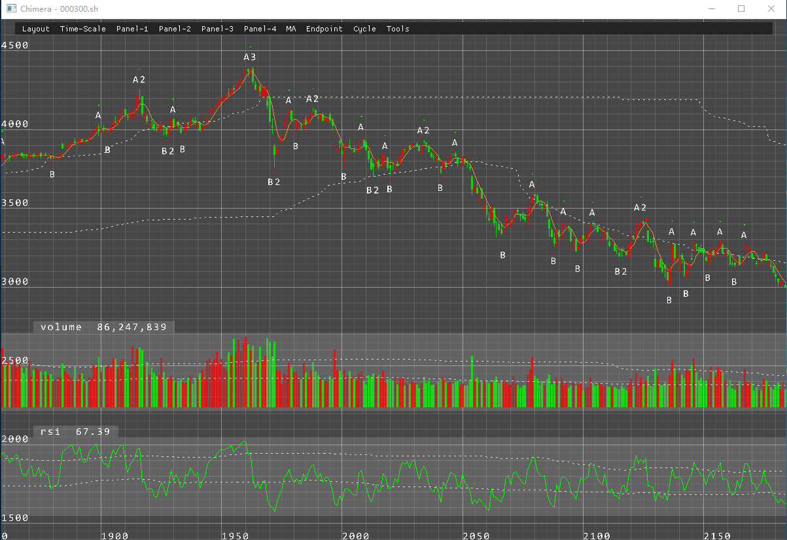
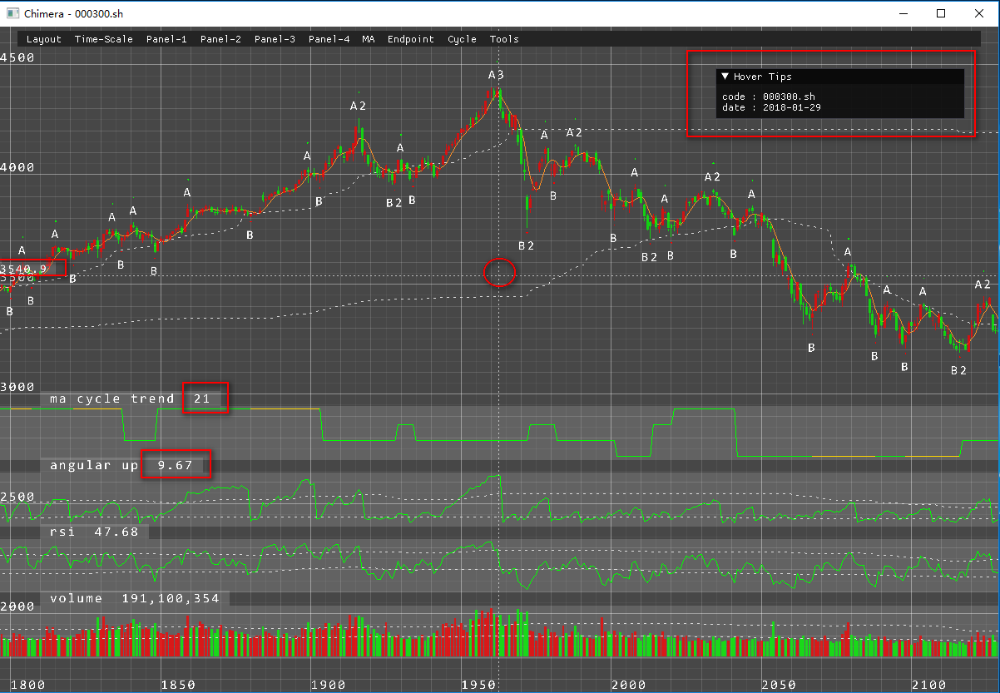
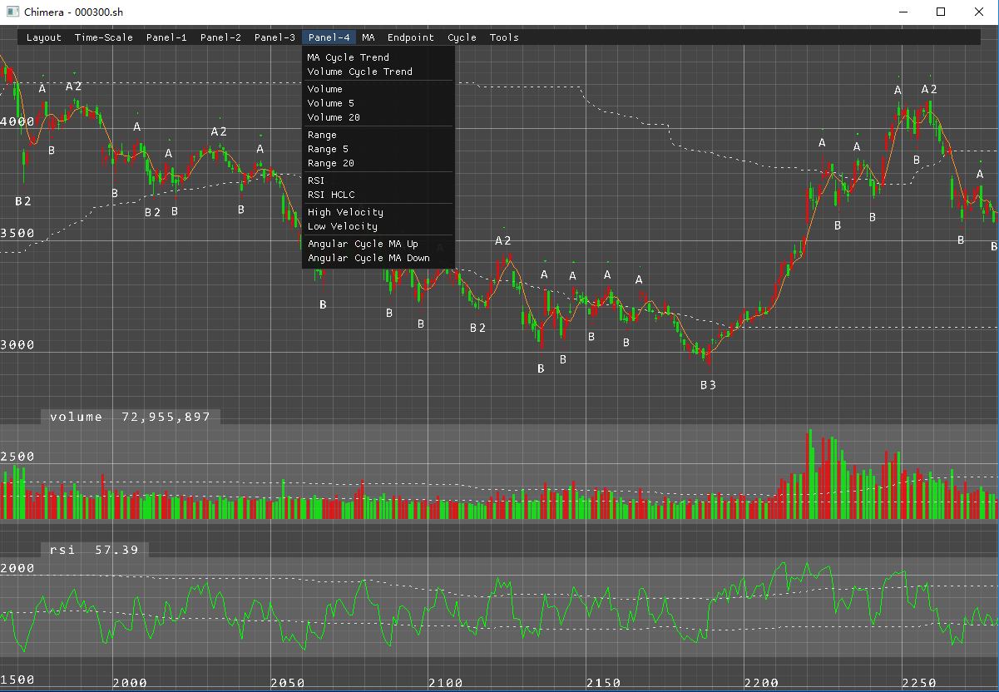
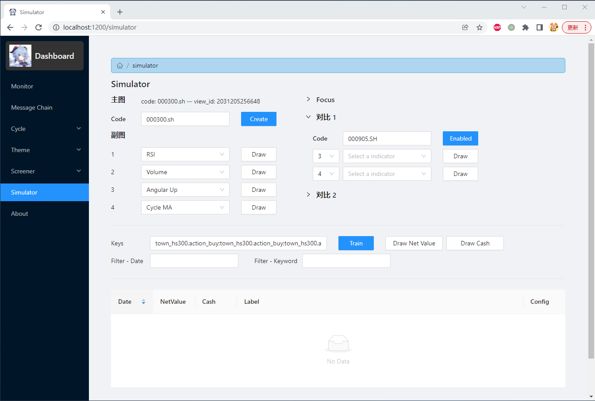

# Plot - Visualization with C++

Interactive data visualization tool, still in developing.

## 需求

接受大量的数据，比如1万大小的数组，绘制出对应的统计图。

筛选了下网络上常见的绘图工具库，没有能够完全满足需求，所以最终决定使用 OpenGL 自行实现。

1. 首先是调查了 Python 常见的数据可视化库 [Matplotlib](https://matplotlib.org/) 。它的问题是，输出的是静态图片，且不可交互。如果是1万数组的折线图，那么宽至少要1万像素，这样查看起来非常费力。

2.  其次是 Python 的开源数据可视化库 [Bokeh](http://bokeh.org/)，它输出的是可交互的网页，且可以用 JavaScript 脚本来扩展特性。
    - 相对于 Matplotlib，Bokeh 能够满足基础的显示和交互两个需求。
    - 对于复杂需求，没有现成的样例契合，需要扩展或者修改源码来实现。虽然 Boken 是开源的，理论上可行，但是花费较大。

考虑到，使用构建 Mesh 或者 Instancing 的方式，绘制大数组并不是件困难的事情。相对于熟悉第三方库的花费，自行实现的花费并不会太大，且可控性更高。

提炼需求： 1. 支持大于1万数组；2. 可交互；3. 多图层叠加；4. 悬停鼠标可以显示数据细节。

## 设计

数据可视化端

整个前后端。

## 功能预览

1. 数据可视化概览，包括：基础统计图，多图层叠加等。

2. 交互概览，包括：鼠标悬停十字线，悬浮窗口显示数据细节等。

3. 菜单栏。

4. 通过网页交互，即网页选择数据集 => 后端加载数据集 => 可视化工具显示。

