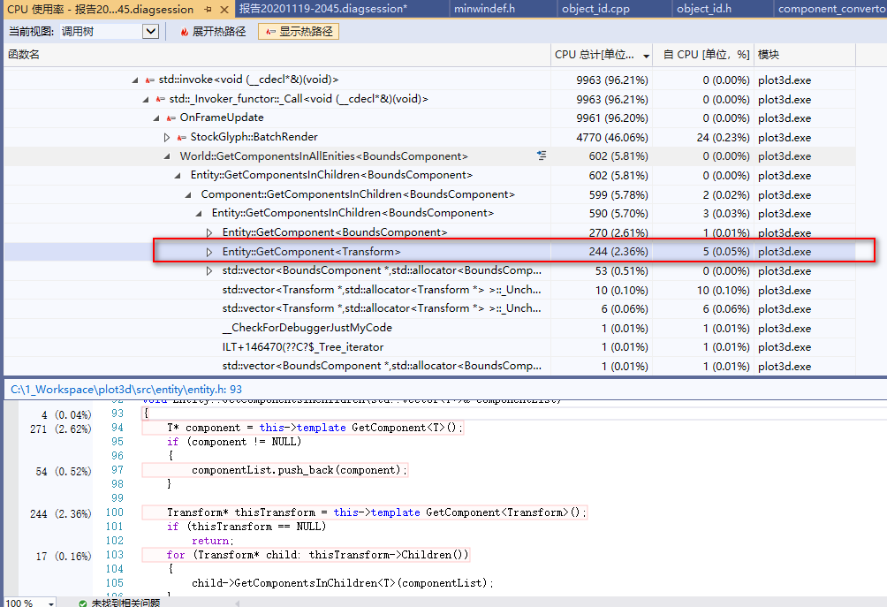
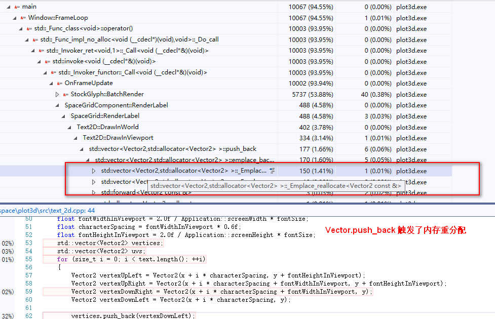
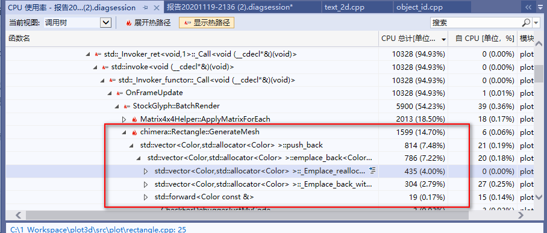
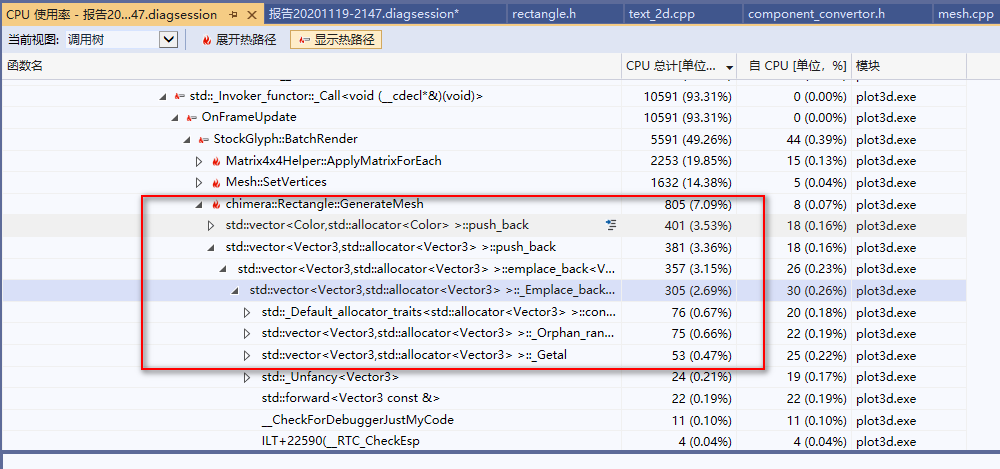
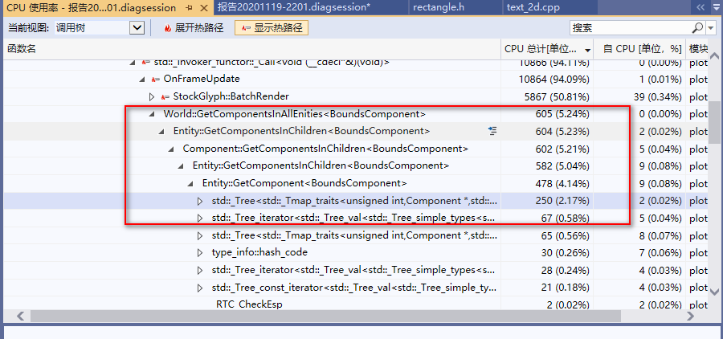
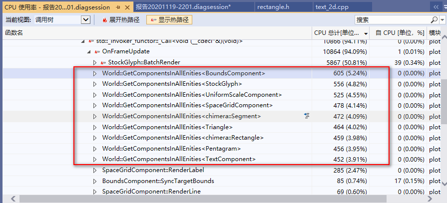
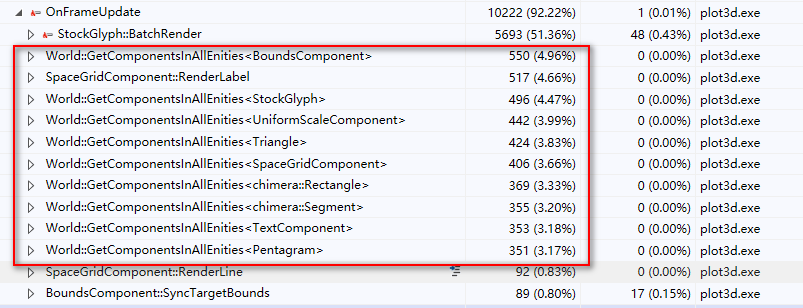
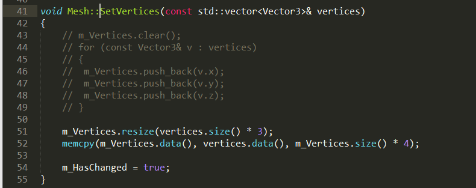
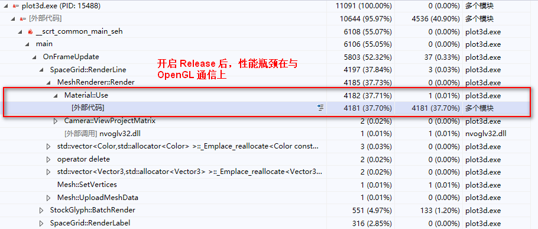
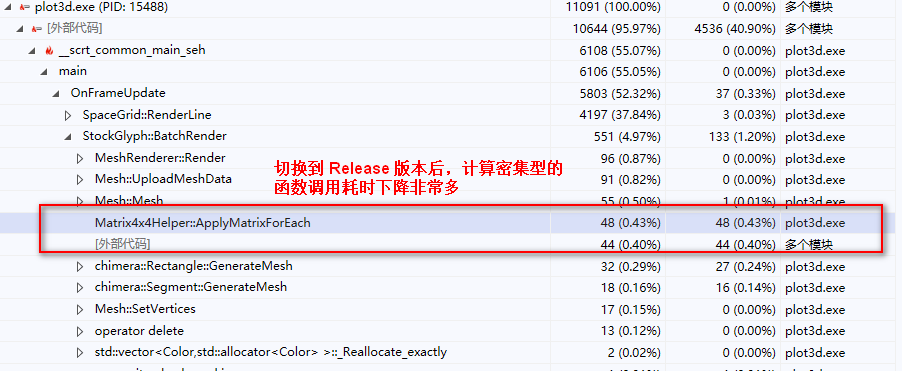

# Performance

一些性能优化的备忘

## 缓存 Transform，而非每次都 GetComponent

## 给 Vector 预留足够的 Capacity

耗时百分比，14.7% -> 7.09%

## 把 map 改为 unorder_map 

优化后

整体的操作流畅度提升很明显，但是从耗时百分比来看，这几个函数似乎没有减少很多。

推测是因为 map 的操作是分散的，不仅仅是这几个地方在调用很多次，其他地方也受益了，耗时同样减少了。所以统计后的耗时对比不明显。

## 不同类型的 vector 之间拷贝

用 memcpy 代替了 push_back，耗时大幅减少。
没有截图，之前采样是 10%，修改后，从耗时排行前面消失找不到了。

## 切换到 Release 版本

Release 版本相对于 Debug 版本，计算密集型的函数调用耗时下降非常多。

